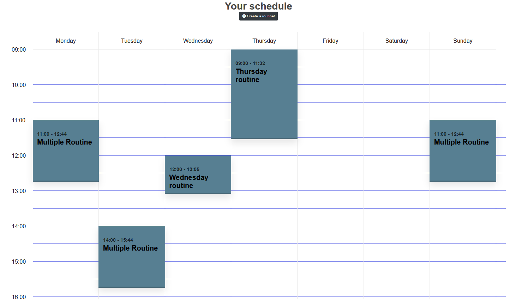

<br />
<div align="center">
  <a href="https://github.com/me50/Johan-Ortegon-1/blob/web50/projects/2020/x/capstone/README.md">
    
  </a>

  <h3 align="center">Final project CS50</h3>
  <h4 align="center">Exercise Dude!</h4>

  <p align="center">
    A Project that will helps you organize your exercises!
    <br />
    <a href="">View Demo</a>
  </p>
</div>

## About The Project
This project can help people organize their exercise schedules, creating routines where they can put together all their favorites’ exercises on a weekly format and make available a place to search and even propose new exercises in order to increase the content of the website. On a technical level the project implements a responsive interface, making smoother the user experience through mobile devices, it also implements API rest calls for database usage on some crucial functionalities, enabling a more transparent experience.

## Distinctiveness and Complexity
The complexity of this website comes from concepts and tools that are uncommon or not even present on the previous projects: **Django REST Framework, @media annotations on the CSS files (allowing the responsiveness) and the implementation of triggers on the database**

### Django REST Framework
The implementation of this tool allows to interact with the database on an asynchronous way, enable performance multiple edition operations by user without refreshing the page. These methods are define on the <em>view.py</em> file.
The URLs are use by Ajax/Js to perform List, Update and Delete Operations:
* 'List':'/list_exercise_routine/<int:pk>/'
* 'UpdatePosition':'/update_exercise_routine_position/<int:pk>/'
* 'UpdateRepetition':'/update_exercise_routine_repetition/<int:pk>/'
* 'Delete':'/delete_exercise_routine/<int:pk>/'


### @media
This tool is implemented on the CSS files and complement the nav bar and index page (<em>style_explore.css, style_head.css and style.css</em>) allowing to adjust the style base on the size of the user screen

### Triggers
The database website use triggers to manipulate data associated with video and video-cover consumption from youtube:
```
CREATE TRIGGER id_excercise_video 
   AFTER INSERT ON excercise_exercise
BEGIN
	UPDATE excercise_exercise
	SET id_link_video = SUBSTR(link_video,INSTR(link_video,'=') + 1, LENGTH(link_video))
	WHERE id = (SELECT MAX(id) FROM excercise_exercise);
END;
```

## Content of each file
### HTML
#### Index.html
This view contains all the routines created by the current user and display them on a weekly format, it also gives access to another view to create a new routine or to click over a routine to see its details.   

<br />
<div align="center">
  <a href="https://github.com/me50/Johan-Ortegon-1/blob/web50/projects/2020/x/capstone/README.md">
    
  </a>
</div>
<br />   

#### header.html
It is an HTML fragment that includes the nav bar and is used on every page of the website to navigate.
#### create_routine.html
Form that allows to create a routine, giving it a name, the days of the week when the user wants to perform it and the start hour on those days.
#### edit_routine.html
In this view the user can check and edit all the information associated with a routine: Name, days of the week when the routines are used, starts hours, the list of exercises within the routine (also their ordinal position and their number of repetitions per exercise)
#### exercise_detail.html
This page displays all the information of an exercise (name, category, description, duration, difficulty, whether or not it requires equipment and a video) it also allows a user to add the exercise to one of his routines. If the current user is an administrator he can approve, delete, or edit the exercise information.
#### explore.html
This page displays all the available exercises on the website, it has a filter section and a search bar that make it easy to search for an exercise, allowing you to search by: name, category, duration, difficulty and whether the exercise requires equipment. If you are an administrator, you can also review user requests to add new exercises to the website.
#### login.html
This page displays the form to logging on the website.
#### register.html
This page displays the form to create a new account.
#### request.html
This page displays a form that users can use to submit an exercise request, filling in the name, category, duration, difficulty, a YouTube video URL and a description. Those requests will appear on the administrators explore page, where they can approve or reject them.

### CSS
#### style.css
Style sheet for the index page, controls the display style of the routines and the transformation of the page when the size is less than 800 px.
#### style_head.css
Style sheet for the header component, controls the way the nav bar is displayed and changes its presentation in case the windows size is less than 816 px.
#### style_explore.css
Style sheet for the explore page, controls the way the exercises are displayed and reorganize them in multiple rows in case the screen size is reduced.
#### style_exercise_detail.css
Style sheet for the exercise detail page, controls the way in which the information is presented and in case of an admin allows to present or hide a form to edit the exercise information.
#### style_edit_routine.css
Style sheet for the edit routine page, controls the way in which the routines information is presented.
#### style_create_routine.css
Style sheet for the create routine page, controls the way in which the form to create a routine is presented.

### JS
#### edit_routine.js
Script to call the API rest methods through Ajax to update, delete and list the exercises associated with a routine on an asynchronous way.
#### exercise_detail.js
Script that allows an admin to show or hide the edit exercise form clicking a button.
#### explore.js
Script that allows an admin to switch between already approved exercises and exercise requests from users.
#### schedule.js
Script to handle the interaction of the user with his schedule (animations, display additional information clicking over a routine, changing the size of the routine base on its duration, getting the start and end hour)


## Install and Run

